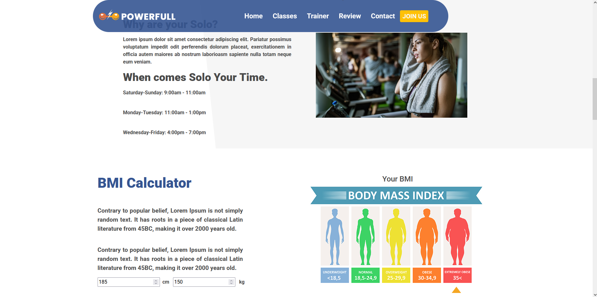

# POWERFULL Gym Project

Bu proje, HTML, CSS ve JavaScript kullanılarak geliştirilmiş modern ve duyarlı bir fitness merkezi ve spor salonu tanıtım sayfasıdır. Kullanıcılara etkileşimli bir deneyim sunmak amacıyla dinamik özellikler eklenmiştir.

## Canlı Demoya Ulaşmak İçin

📌 https://glowing-elf-7f90ba.netlify.app 📌

## Web Sitesinin Ufak Bir Önizlemesi

---

## İçindekiler

- [Genel Bakış](#genel-bakış)
- [Özellikler](#özellikler)
- [Kullanılan Teknolojiler](#kullanılan-teknolojiler)
- [Çalışma Mantığı / Dosya Yapısı](#çalışma-mantığı--dosya-yapısı)
- [Katkıda Bulunma](#katkıda-bulunma)
- [İletişim](#i̇letişim)

---

## Genel Bakış

Bu proje, bir spor salonu veya fitness merkezinin sunduğu hizmetleri, antrenörleri ve ürünleri sergileyen tek sayfalık bir web sitesidir. Kullanıcı etkileşimini artırmak için JavaScript ile çalışan dinamik "Sınıflar" bölümü ve bir Vücut Kitle Endeksi (BMI) hesaplayıcısı entegre edilmiştir. Sayfa yapısı düzenli, kodları temiz ve mobil uyumludur.

## Özellikler

- **Duyarlı Tasarım:** Site, farklı ekran boyutlarına (masaüstü, tablet, mobil) uyum sağlayacak şekilde tasarlanmıştır.
- **Dinamik Navigasyon Barı:** Kullanıcı sayfayı aşağı kaydırdıkça şeffaf olan navigasyon barı renk değiştirerek daha belirgin hale gelir.
- **Dinamik Sınıf Seçimleri:** Kullanıcı, "Classes" bölümünde yer alan Yoga, Group, Solo ve Stretching gibi butonlara tıklayarak ilgili sınıf hakkında detaylı bilgiyi anında görebilir.
- **İnteraktif BMI Hesaplayıcı:** Kullanıcının boy ve kilo bilgilerini girerek vücut kitle indeksini (BMI) hesaplayabileceği bir araç sunulur. Hesaplama sonucuna göre ilgili BMI kategorisini işaretleyen dinamik bir gösterge de bulunur.
- **Antrenör Profilleri:** En iyi antrenörlerin görsellerini ve unvanlarını sergileyen, üzerine gelindiğinde detayların gösterildiği özel animasyonlu kartlar mevcuttur.
- **Ürün Kartları:** Satın alınabilecek ürünlerin görselleri, fiyat bilgileri ve sepete ekleme simgesi içeren kartlar yer alır.
- **Müşteri Yorumları:** Müşterilerin geri bildirimlerini sergileyen, kurdele şeklinde tasarlanmış şık yorum kutuları bulunur.

## Kullanılan Teknolojiler

- **HTML5:** Sayfa yapısının iskeletini oluşturmak için.
- **CSS3:** Sayfaların stil ve düzenini sağlamak için (`main.css` dosyası).
- **JavaScript (ES6+):** Uygulamanın dinamik işlevselliğini (navigasyon barı, sınıf seçimleri, BMI hesaplayıcı) yönetmek için (`main.js` ve `bmi.js` dosyaları).
- **Bootstrap 4.5.3:** Temel UI bileşenleri ve responsive tasarım için (CDN üzerinden).
- **jQuery:** Bootstrap'in bazı özelliklerini kullanmak için (CDN üzerinden).
- **Font Awesome:** İkon kullanımı için (CDN üzerinden).

## Çalışma Mantığı / Dosya Yapısı

Proje, temel olarak üç ana dosyadan ve bir dizi medya içeriğinden oluşur:

1.  **`index.html`:** Sayfanın tüm HTML yapısını içerir. Navigasyon barı, ana sayfa (hero), istatistikler, sınıflar, BMI hesaplayıcı, antrenörler, ürünler, müşteri yorumları, iletişim ve altbilgi (footer) bölümlerini barındırır. Tüm CSS ve JavaScript dosyaları bu sayfada linklenir.
2.  **`main.css`:** Sayfanın görsel stilini (renkler, fontlar, boyutlar, animasyonlar) belirleyen ana stil dosyasıdır. Navbar, hero section ve diğer tüm bölümlere ait özel stiller bu dosyada yer alır.
3.  **`main.js`:** İki ana işlevi yerine getirir:
    - Sayfa kaydırıldığında navigasyon barının arka plan rengini değiştiren bir scroll olayı dinleyicisi.
    - "OUR CLASSES" bölümündeki butonlara tıklandığında ilgili sınıf içeriğini gösteren ve diğerlerini gizleyen bir işlev.
4.  **`bmi.js`:** Sadece BMI hesaplayıcısının işlevselliğinden sorumludur. Kullanıcıdan alınan boy ve kilo değerlerine göre BMI'yı hesaplar ve hesaplama sonucunu bir gösterge (pointer) ile görsel olarak ekranda gösterir.

## Katkıda Bulunma

Projeye katkıda bulunmak isterseniz, lütfen aşağıdaki adımları izleyin:

1.  Bu depoyu (repository) **fork edin**.
2.  Yeni bir dal (branch) oluşturun: `git checkout -b main`
3.  Değişikliklerinizi yapın ve commit edin: `git commit -m 'Buraya commitinizi yazınız'`
4.  Dalı push edin: `git push -u origin main`
5.  Bir **Pull Request (PR)** oluşturun.

## İletişim

Can BOZ - [LinkedIn Profilin](https://www.linkedin.com/in/emrecanboz)
